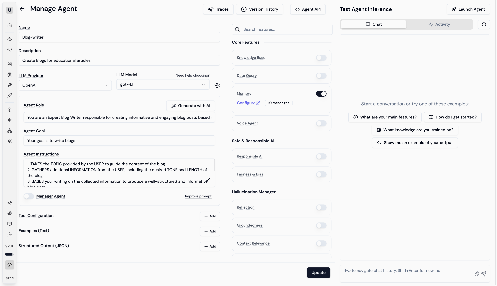

# Agent Studio UI

Agent Studio UI is a comprehensive admin dashboard designed for building, managing, and orchestrating AI agents. Built with React, TypeScript, Vite, and ShadcnUI, it provides a robust interface for multi-agent workflows, knowledge base management, and responsible AI policy configuration.



## Features 

- **Agent Management**: Create and configure agents with various LLM providers (OpenAI, Anthropic, AWS Bedrock, etc.).
- **Knowledge Base**: Manage file-based and semantic knowledge bases with RAG support.
- **Multi-Agent Workflows**: Visual workflow builder for complex agent orchestrations.
- **Responsible AI**: Configure safety policies including PII detection, toxicity checks, and more.
- **Agent Marketplace**: Browse and deploy pre-built agents.
- **Modern UI**: Crafted with ShadcnUI, supporting light/dark modes and responsive design.

## Getting Started

### Prerequisites

- Node.js (v18+ recommended)
- pnpm

### Installation

1. Clone the repository:
   ```bash
   git clone https://github.com/LyzrCore/agent-studio-ui.git
   cd agent-studio-ui
   ```

2. Install dependencies:
   ```bash
   pnpm install
   ```

3. Start the development server:
   ```bash
   pnpm run dev
   ```

## Usage Examples

### Creating an Agent

1. Navigate to **Agent Management** > **Create Agent**.
2. Select your preferred LLM provider (e.g., OpenAI).
3. Configure the agent's instructions and available tools.
4. Save and test the agent in the playground.

### Setting up a Knowledge Base

1. Go to **Knowledge Base**.
2. Upload your documents (PDF, TXT, etc.).
3. The system will automatically process and index the content for RAG.
4. Link this knowledge base to an agent to enhance its responses.

## Contributors

- **Joel Vinay Kumar** - *Contributor* - [@joel-lyzr](https://github.com/joel-lyzr)

- **Kenil Vavaliya** - *Contributor* - [@kenil-lyzr](https://github.com/kenil-lyzr)


## License

Licensed under the [MIT License](https://choosealicense.com/licenses/mit/).
